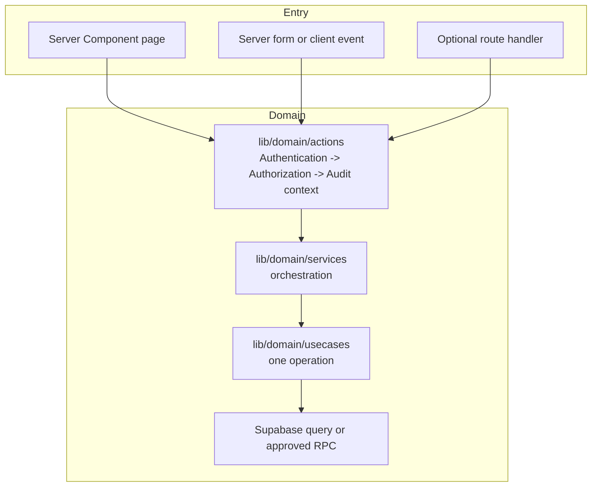

# OrgAudit Project Architecture

This document describes how **OrgAudit** is structured: the runtime stack, dependencies, Next.js App Router and Atomic Design UI layers, the domain-oriented `lib` layout, Supabase Auth/PostgreSQL/RLS, and the migration-driven hosted database workflow.

Representative code samples for each required layer appear in [Full code samples by folder](#full-code-samples-by-folder).

> **Scope:** OrgAudit is a VSU-only, multi-organization financial-accountability application. It owns financial source data and generates Attachment C. Attachment A/B source workflows, receipt uploads, Docker-local Supabase, Drizzle, Better Auth, MySQL, PWA/offline storage, and generic trading/banking features are intentionally not part of this architecture.

---

## Table of contents

- [Stack](#stack)
- [Dependencies](#dependencies)
  - [Runtime dependencies](#runtime-dependencies)
  - [Development dependencies](#development-dependencies)
  - [npm scripts](#npm-scripts)
- [Repository layout](#repository-layout)
- [Domain layer - request flow](#domain-layer---request-flow)
  - [Reads and writes](#reads-and-writes)
  - [Actions - inline AAA](#actions---inline-aaa)
  - [Services - orchestration](#services---orchestration)
  - [Use cases - one operation per file](#use-cases---one-operation-per-file)
  - [Entities - domain types](#entities---domain-types)
- [Supabase Auth, authorization, and environment](#supabase-auth-authorization-and-environment)
  - [Position-based authentication](#position-based-authentication)
  - [Environment](#environment)
  - [Route protection](#route-protection)
  - [Auth UI](#auth-ui)
- [Next.js frontend structure](#nextjs-frontend-structure)
  - [App Router](#app-router)
  - [Atomic Design components](#atomic-design-components)
  - [Actions versus UI hooks](#actions-versus-ui-hooks)
  - [Frontend conventions](#frontend-conventions)
- [Design system](#design-system)
- [Hosted Supabase development](#hosted-supabase-development)
- [Workflows](#workflows)
  - [End-to-end flow](#end-to-end-flow)
  - [Add a schema change](#add-a-schema-change)
  - [Add a domain feature](#add-a-domain-feature)
  - [Add a UI feature](#add-a-ui-feature)
  - [Optional HTTP route](#optional-http-route)
  - [Checklist](#checklist)
- [Full code samples by folder](#full-code-samples-by-folder)
- [Cross-cutting concerns](#cross-cutting-concerns)
- [Version reference](#version-reference)

---

## Stack

| Layer | Technology | OrgAudit use |
|---|---|---|
| Framework | **Next.js 16** | App Router, React Server Components by default, Server Actions, route handlers, root `proxy.ts`. |
| UI | **React 19** | Client components opt in with `"use client"` only for browser interaction. |
| Language | **TypeScript 5** | Strict mode and `@/` import alias. All IDs remain UUID strings. |
| Styling | **Tailwind CSS 4** | Tokens from `docs/DESIGN_TOKEN.md`; light-only institutional finance UI. |
| Auth | **Supabase Auth** | Reusable position-account email/password sign-in and session management. |
| Database | **Supabase PostgreSQL** | Authoritative ledger, PostgreSQL constraints, RLS, security-definer helpers, controlled mutation RPCs. |
| Database client | **@supabase/supabase-js + @supabase/ssr** | Browser/server clients and cookie-backed server sessions. |
| Validation | **Zod** | Validates all Server Action and route-handler input before it reaches a service. |
| Hosted database workflow | **Supabase CLI** | Migration files, hosted project linking, remote `db push`, type generation. |
| Deployment | **Vercel** | Hosts the Next.js application. Supabase hosts database, Auth, and private Attachment C PDF Storage. |
| PDF reports | Server-side renderer, selected in reporting phase | Renders immutable Attachment C snapshots. |
| Tests | Vitest + Playwright + Supabase SQL/RPC tests | Unit, browser, integration, migration, RLS, and financial integrity coverage. |
| Fonts | Inter + IBM Plex Mono | UI text and tabular financial data, respectively. |

### Runtime model

```text
Browser UI
  -> Server Component read or Server Action / route handler
  -> lib/domain/actions (authentication, authorization, audit context)
  -> lib/domain/services (workflow orchestration)
  -> lib/domain/usecases (one scoped query or controlled RPC call)
  -> Supabase Auth / PostgreSQL RLS / approved RPC
  -> scoped result back to UI
```

Supabase RLS is the final authorization boundary. Server code never trusts client-provided organization, actor, role, position-holder, or signer values.

---

## Dependencies

### Runtime dependencies

| Package | Role |
|---|---|
| `next`, `react`, `react-dom` | Next.js application and React runtime. |
| `@supabase/supabase-js` | Supabase database/Auth client. |
| `@supabase/ssr` | Cookie-aware browser and server client setup. |
| `zod` | Server-side request validation. |
| `clsx` and `tailwind-merge` | Class name composition. |
| `lucide-react` | Accessible interface icons. |
| `class-variance-authority` | Optional variants for shared Atomic Design components. |

Install report-rendering, charting, or UI-library dependencies only when their roadmap phase is approved. Do not add receipt-upload, ORM, or alternate-auth packages.

### Development dependencies

| Package | Role |
|---|---|
| `typescript`, `@types/node`, `@types/react`, `@types/react-dom` | Type checking. |
| `tailwindcss`, `@tailwindcss/postcss` | Tailwind CSS v4. |
| `eslint`, `eslint-config-next` | Linting. |
| `supabase` | Project-scoped CLI for hosted migration and type workflows. |
| `vitest` | Unit and service/use-case tests. |
| `@playwright/test` | End-to-end browser testing. |

### npm scripts

Use script names similar to the following. Exact commands can be adjusted to the generated project configuration.

| Script | Command | Purpose |
|---|---|---|
| `dev` | `next dev` | Local Next.js application. |
| `build` | `next build` | Production build. |
| `start` | `next start` | Run built app. |
| `lint` | `eslint .` | Lint source. |
| `typecheck` | `tsc --noEmit` | Strict TypeScript check. |
| `test` | `vitest run` | Unit/integration tests. |
| `test:e2e` | `playwright test` | Browser workflows. |
| `db:push:dry` | `npx supabase db push --dry-run` | Review pending hosted migrations. |
| `db:push` | `npx supabase db push` | Apply reviewed migrations to linked hosted project. |
| `db:types` | `npx supabase gen types typescript --project-id YOUR_PROJECT_REF > lib/entities/database.types.ts` | Regenerate database types. |
| `db:status` | `npx supabase migration list` | Compare local migrations and hosted history. |

Do not add `supabase start` or `supabase db reset` scripts: this project does not use Docker/local Supabase. Never use `supabase db reset --linked` against a hosted project.

---

## Repository layout

```text
org-auditing-system/
├── AGENTS.md                         # Agent rules and completion bar
├── README.md
├── proxy.ts                           # Next.js 16 route/session protection
├── package.json
├── tsconfig.json
├── next.config.ts
├── postcss.config.mjs
├── .env.local                         # Never commit
├── .env.example                       # Safe variable names only
│
├── app/
│   ├── layout.tsx                     # Fonts, root layout, metadata
│   ├── page.tsx                       # Landing page
│   ├── globals.css                    # Tailwind v4 + approved design tokens
│   ├── (auth)/
│   │   ├── login/page.tsx
│   │   ├── forgot-password/page.tsx
│   │   └── reset-password/page.tsx
│   ├── dashboard/page.tsx
│   ├── transactions/page.tsx
│   ├── transfers/page.tsx
│   ├── opening-balances/page.tsx
│   ├── events/page.tsx
│   ├── reports/page.tsx
│   ├── settings/page.tsx
│   └── admin/
│       ├── organizations/page.tsx
│       ├── periods/page.tsx
│       └── handovers/page.tsx
│
├── components/
│   ├── atoms/                         # Buttons, inputs, labels, badges
│   ├── molecules/                     # Metric cards, form fields, filter bar
│   ├── organisms/                     # Ledger table, transaction form, dashboard panel
│   ├── templates/                     # Dashboard and admin page layouts
│   └── ui/                            # Shared low-level primitives
│
├── utils/
│   └── supabase/
│       ├── client.ts                  # Browser client
│       ├── server.ts                  # Server client
│       └── middleware.ts              # Session refresh helper used by proxy.ts
│
├── lib/
│   ├── domain/
│   │   ├── actions/                   # "use server"; inline AAA entry point
│   │   ├── services/                  # Orchestration only
│   │   └── usecases/                  # One database/Auth/RPC operation per file
│   ├── entities/
│   │   ├── database.types.ts          # Generated from hosted Supabase; do not hand-edit
│   │   ├── position.types.ts
│   │   ├── transaction.types.ts
│   │   ├── report.types.ts
│   │   └── result.types.ts
│   ├── validation/                    # Zod request schemas
│   ├── constants/                     # Display constants only; not authorization source
│   └── utils.ts
│
├── supabase/
│   ├── config.toml
│   ├── migrations/                    # Ordered schema, RLS, helper, RPC changes
│   ├── tests/                         # SQL/RLS/RPC/constraint tests
│   └── seed.sql                       # Safe catalog and test fixtures
│
├── tests/
│   ├── unit/
│   ├── integration/
│   └── e2e/
│
├── public/
│   └── images/
│
└── docs/
    ├── REQUIREMENTS.md
    ├── ARCHITECTURE.md
    ├── DOMAIN_MODEL_AND_SCHEMA_PLAN.md
    ├── AUTH_AND_RBAC.md
    ├── SUPABASE_RLS_SECURITY.md
    ├── TESTING.md
    ├── DEVELOPMENT_RULES.md
    ├── IMPLEMENTATION_ROADMAP.md
    └── DESIGN_TOKEN.md
```

There are no controllers and no general `database/` folder. The Supabase client lives in `utils/supabase`, generated database types live in `lib/entities`, and database definition/version history lives in `supabase/migrations`.

---

## Domain layer - request flow

### Reads and writes

Both protected reads and writes use the same domain path:



| Call | Entry | Required path | Example |
|---|---|---|---|
| Protected read | Server Component | action → service → use case → scoped select/RPC | Dashboard balances |
| Mutation | Form/client event | action → service → use case → controlled RPC | Create transaction |
| Public auth | Auth form | auth action → Supabase Auth | Sign in/reset password |
| External integration | Route handler | action/service logic or dedicated server module | Future signed report download only if needed |

Server Components remain the default. Use a Client Component only for interaction, browser APIs, modal state, charting, or optimistic UI.

### Actions - inline AAA

Each protected file under `lib/domain/actions` begins with `"use server"`. The action owns the visible security entry point:

1. **Authentication:** retrieve the Supabase user/session.
2. **Authorization:** resolve the active position context and verify the action's allowed role/organization/period.
3. **Audit context:** pass no browser-supplied actor or organization ID. Use the authenticated server context; the controlled database RPC creates the canonical audit event.

Actions validate inputs, call exactly one service, return a safe result, and revalidate appropriate paths after successful mutations.

Do not put Server Actions under `app/**/actions.ts`. The approved location is `lib/domain/actions/<feature>.actions.ts`.

#### Inline AAA template

```ts
"use server";

import { revalidatePath } from "next/cache";
import { createClient } from "@/utils/supabase/server";
import { createTransactionInputSchema } from "@/lib/validation/transaction.schema";
import { createTransactionService } from "@/lib/domain/services/transactions.service";
import type { ActionResult } from "@/lib/entities/result.types";

export async function createTransactionAction(
  rawInput: unknown,
): Promise<ActionResult<{ id: string }>> {
  // 1. Authentication
  const supabase = await createClient();
  const { data: { user }, error: authError } = await supabase.auth.getUser();

  if (authError || !user) {
    return { ok: false, error: "Authentication required." };
  }

  // 2. Authorization
  // This RPC derives the active position from auth.uid(); it is not browser input.
  const { data: context, error: contextError } =
    await supabase.rpc("get_active_position_context");

  if (contextError || !context) {
    return { ok: false, error: "No active organization position is available." };
  }

  if (!["treasurer", "auditor"].includes(context.role)) {
    return { ok: false, error: "You are not authorized to create transactions." };
  }

  const parsed = createTransactionInputSchema.safeParse(rawInput);
  if (!parsed.success) {
    return { ok: false, error: "Please correct the highlighted fields." };
  }

  // 3. Audit context
  // The service/use case passes only business input. The database RPC derives
  // actor and organization from auth.uid() and writes the authoritative audit log.
  const result = await createTransactionService(supabase, parsed.data);

  if (!result.ok) return result;

  revalidatePath("/transactions");
  revalidatePath("/dashboard");
  return result;
}
```

The final RLS/RPC migration defines `get_active_position_context` and `create_transaction`. Until that migration exists, actions must not substitute insecure direct table inserts.

### Services - orchestration

Services coordinate a workflow. They may call multiple use cases but do not implement UI concerns, parse `FormData`, or accept an untrusted actor/organization.

Examples:

- `transactions.service.ts`: create, revise, or void a transaction by calling controlled RPC use cases.
- `balances.service.ts`: coordinate period selection and derived Bank/Cash queries.
- `attachment-c.service.ts`: validate generation request, create snapshot version, render PDF, and update private storage metadata.
- `handovers.service.ts`: coordinate initiation/cancellation; Super-Admin completion additionally invokes controlled position/session workflows.

A service must not bypass use cases to write arbitrary Supabase tables.

### Use cases - one operation per file

A use case performs one scoped database/Auth operation. File names are explicit and verb-based.

```text
lib/domain/usecases/
├── positions/
│   └── get_active_position_context.usecase.ts
├── transactions/
│   ├── create_transaction.usecase.ts
│   ├── revise_transaction.usecase.ts
│   └── void_transaction.usecase.ts
├── transfers/
│   └── create_fund_transfer.usecase.ts
├── balances/
│   └── get_period_balances.usecase.ts
├── reports/
│   ├── generate_attachment_c_version.usecase.ts
│   └── sign_attachment_c_version.usecase.ts
└── handovers/
    └── initiate_handover.usecase.ts
```

Use cases use a typed Supabase client and query only tenant-scoped views/tables or approved RPCs. They never use service-role credentials.

### Entities - domain types

`lib/entities` contains types shared across actions, services, use cases, and UI. It is not another database schema.

- `database.types.ts` is generated from Supabase and must never be manually edited.
- Feature types transform generated rows into UI/domain-friendly data.
- `result.types.ts` exports `ActionResult<T>` for safe action results.
- Constants may map a role/status to labels, but database/RLS is the authority for permissions.

---

## Supabase Auth, authorization, and environment

### Position-based authentication

Supabase Auth authenticates reusable position accounts. The database maps `auth.uid()` to an active `positions` row and active `position_holders` row. The user interface may display the human holder's profile but must not assume the profile ID is the authenticated account ID.

```text
auth.users user
  -> positions.auth_user_id
  -> positions.organization_id + role
  -> active position_holders row
  -> profiles human identity
```

A Super-Admin is separate through `system_admins`. Organization officers cannot create organizations or complete handovers. Presidents cannot mutate financial source data.

### Environment

Commit `.env.example`, never `.env.local`.

```bash
# .env.example
NEXT_PUBLIC_SUPABASE_URL=
NEXT_PUBLIC_SUPABASE_ANON_KEY=
```

Add a server-only variable only when an approved server operation needs it:

```bash
SUPABASE_SERVICE_ROLE_KEY=
```

A service-role key is never imported into a browser component, exposed through `NEXT_PUBLIC_*`, logged, or needed for ordinary app actions. Ordinary actions use the session-aware server client and RLS/RPCs.

### Route protection

Next.js 16 uses root `proxy.ts`. It calls the session-refresh helper in `utils/supabase/middleware.ts`. Proxy redirects anonymous users away from protected routes; it does not replace RLS or action-level authorization.

Protected prefixes:

```text
/dashboard
/transactions
/transfers
/opening-balances
/events
/reports
/settings
/admin
```

The `/admin` route needs a Super-Admin check in its server layout/page in addition to the proxy's authenticated-session check.

### Auth UI

Auth pages live under `app/(auth)`:

- `login/page.tsx`
- `forgot-password/page.tsx`
- `reset-password/page.tsx`

They use Supabase Auth actions. They do not use protected inline AAA because users may not yet be authenticated. Password handover/session invalidation requires privileged, audited server-side administration and must not be implemented as a browser-only flow.

---

## Next.js frontend structure

### App Router

| Area | Route responsibility |
|---|---|
| `(auth)` | Sign-in, password recovery, reset password. |
| `dashboard` | Organization liquidity and analytics. |
| `transactions` | Ledger, revision history, void workflow. |
| `transfers` | Bank ↔ Cash-on-Hand internal movement. |
| `opening-balances` | Manual semester opening balance workflow. |
| `events` | Activities/projects and event financial view. |
| `reports` | Attachment C generation, versioning, signatures, private download, CSV. |
| `settings` | Position/profile context and turnover initiation. |
| `admin` | Super-Admin provisioning, periods, and handover completion. |

Each route should use `loading.tsx`, `error.tsx`, `not-found.tsx`, or protected layouts when the feature benefits from them. Default runtime is Node.js. Do not opt into Edge unless a specific route has a tested reason.

### Atomic Design components

```text
components/
├── atoms/
│   ├── Button/
│   ├── Input/
│   ├── Label/
│   ├── Badge/
│   └── MoneyText/
├── molecules/
│   ├── FormField/
│   ├── MetricCard/
│   ├── PeriodSelector/
│   ├── FundSourceBadge/
│   └── TransactionStatusBadge/
├── organisms/
│   ├── LedgerTable/
│   ├── TransactionForm/
│   ├── RevisionHistory/
│   ├── LiquidityDashboard/
│   ├── AttachmentCPreview/
│   └── HandoverRequestForm/
├── templates/
│   ├── DashboardTemplate/
│   └── AdminTemplate/
└── ui/
    └── shared low-level primitives
```

Rules:

- **Atoms** do not know business entities or call Supabase.
- **Molecules** compose atoms and may accept feature-neutral props.
- **Organisms** may understand a feature's view model but do not perform database writes or authorization.
- **Templates** assemble page layout and slots, not business logic.
- **Pages** fetch through actions/services and pass serializable view data downward.

### Actions versus UI hooks

- A Server Action imports from `lib/domain/actions` and performs mutation/read orchestration.
- A Client Component may submit an action or call a server action through a supported form/event pattern.
- A UI hook owns browser state only: dialog visibility, filter selection, pagination, optimistic row state, or formatting.
- UI hooks do not call Supabase directly for protected data and do not reproduce financial calculation or permission logic.

### Frontend conventions

- Use server-rendered pages and Server Components by default.
- Use `next/font` for Inter and IBM Plex Mono; map them to the approved token variables.
- Use `next/image` for local/static images.
- Use the agreed Tailwind v4 tokens in `app/globals.css`.
- Right-align `font-mono font-tabular` currency/quantity columns.
- Display written status labels with semantic colors; never communicate state by color alone.
- Render Bank and Cash on Hand with their approved named colors and labels.
- Use accessible confirmation dialogs before a void action.

---

## Design system

`docs/DESIGN_TOKEN.md` is authoritative for color, font, spacing, elevation, motion, and component behavior.

Required design decisions:

| Concern | Rule |
|---|---|
| Brand/navigation | Deep navy primary. |
| Primary action/focus | Indigo secondary. |
| Financial text | Inter UI; IBM Plex Mono/tabular numerals for amounts and vouchers. |
| Fund source | Named Bank blue and Cash purple tokens, always accompanied by labels. |
| Semantic state | Soft badges/banners preferred; text/icon complements color. |
| Tables | Compact, clear header rule, subtle internal grid, right-aligned numeric data. |
| Motion | Short confirmation motion only; no stock ticker, live-price, or continuous pulses. |

---

## Hosted Supabase development

This project uses a **hosted Supabase project** with Vercel deployment. Docker is not required.

### Setup

```bash
npx supabase init
npx supabase login
npx supabase link --project-ref YOUR_PROJECT_REF
```

### Database workflow

```text
Create migration
  -> review SQL and security implications
  -> npx supabase db push --dry-run
  -> npx supabase db push
  -> npx supabase gen types typescript --project-id YOUR_PROJECT_REF > lib/entities/database.types.ts
  -> run typecheck and relevant tests
```

Rules:

- Every remote schema change is a reviewed migration in `supabase/migrations`.
- Do not edit hosted schema directly in the Table Editor/SQL Editor after migrations are adopted.
- Do not run `supabase db reset --linked`. It is destructive to the hosted project.
- Keep a separate hosted development/staging project for tests that modify data; production is not a test database.
- RLS/security changes require at least two-organization positive and negative tests.

---

## Workflows

### End-to-end flow

```text
Requirement / approved decision
  -> migration or source change plan
  -> action (AAA) -> service -> use case -> RLS/RPC
  -> Atomic Design UI
  -> unit/database/integration/E2E verification
  -> documentation/type update
```

### Add a schema change

1. Check `docs/REQUIREMENTS.md`, domain plan, RBAC, and RLS design.
2. Create a migration: `npx supabase migration new descriptive_name`.
3. Include constraints, indexes, tenant integrity, and RLS/RPC updates when required.
4. Review the migration with `npx supabase db push --dry-run`.
5. Apply only to the linked development/staging project after review.
6. Regenerate `lib/entities/database.types.ts`.
7. Add SQL/RPC/RLS tests and typecheck all dependent domain code.
8. Update the relevant documentation if the approved design changes.

### Add a domain feature

Example: a fund transfer.

1. Add Zod schema: `lib/validation/fund-transfer.schema.ts`.
2. Add one use case: `lib/domain/usecases/transfers/create_fund_transfer.usecase.ts`.
3. Add orchestration only if needed: `lib/domain/services/transfers.service.ts`.
4. Add `"use server"` action with inline AAA: `lib/domain/actions/transfers.actions.ts`.
5. Ensure the controlled database RPC derives the actor/org, requires an open period, checks source ≠ destination, and writes audit history.
6. Add unit and integration/RLS tests proving total liquidity is unchanged and President is denied.

### Add a UI feature

1. Create atoms only for reusable, feature-neutral UI.
2. Compose molecules for reusable financial controls.
3. Create an organism for the feature view, e.g. `components/organisms/FundTransferForm`.
4. Use a template only when the layout is reused across pages.
5. Add the App Router page under the corresponding `app/` route.
6. Verify keyboard navigation, focus states, clear error messages, status labels, and mobile layout.
7. Do not put authorization, Supabase queries, or balance calculation into a UI component.

### Optional HTTP route

Use `app/api/**/route.ts` only when an HTTP endpoint is genuinely necessary—for example a future signed report-download endpoint or third-party webhook. Normal internal form mutations use Server Actions. Route handlers must use the same authentication, authorization, and tenant rules as actions.

### Checklist

- [ ] Requirement and affected docs reviewed.
- [ ] Input validation added.
- [ ] Action → service → use case path followed.
- [ ] Server/database derives actor, role, organization, and signer.
- [ ] Migration and generated types updated when schema changes.
- [ ] RLS/tenant-negative tests added when security or financial access changes.
- [ ] Financial revisions/voids/transfer semantics preserved.
- [ ] Atomic Design boundaries respected.
- [ ] Typecheck, lint, and relevant tests pass.
- [ ] Report layout visually inspected when Attachment C changes.

---

## Full code samples by folder

### `utils/supabase/server.ts`

```ts
import { createServerClient } from "@supabase/ssr";
import { cookies } from "next/headers";
import type { Database } from "@/lib/entities/database.types";

export async function createClient() {
  const cookieStore = await cookies();

  return createServerClient<Database>(
    process.env.NEXT_PUBLIC_SUPABASE_URL!,
    process.env.NEXT_PUBLIC_SUPABASE_ANON_KEY!,
    {
      cookies: {
        getAll: () => cookieStore.getAll(),
        setAll: (cookiesToSet) => {
          try {
            cookiesToSet.forEach(({ name, value, options }) => {
              cookieStore.set(name, value, options);
            });
          } catch {
            // A Server Component cannot always write cookies.
            // proxy.ts refreshes sessions for normal browser navigation.
          }
        },
      },
    },
  );
}
```

### `utils/supabase/client.ts`

```ts
import { createBrowserClient } from "@supabase/ssr";
import type { Database } from "@/lib/entities/database.types";

export function createClient() {
  return createBrowserClient<Database>(
    process.env.NEXT_PUBLIC_SUPABASE_URL!,
    process.env.NEXT_PUBLIC_SUPABASE_ANON_KEY!,
  );
}
```

### `utils/supabase/middleware.ts` and root `proxy.ts`

```ts
// utils/supabase/middleware.ts
import { createServerClient } from "@supabase/ssr";
import { NextResponse, type NextRequest } from "next/server";
import type { Database } from "@/lib/entities/database.types";

export async function updateSession(request: NextRequest) {
  let response = NextResponse.next({ request });

  const supabase = createServerClient<Database>(
    process.env.NEXT_PUBLIC_SUPABASE_URL!,
    process.env.NEXT_PUBLIC_SUPABASE_ANON_KEY!,
    {
      cookies: {
        getAll: () => request.cookies.getAll(),
        setAll: (cookiesToSet) => {
          cookiesToSet.forEach(({ name, value }) => request.cookies.set(name, value));
          response = NextResponse.next({ request });
          cookiesToSet.forEach(({ name, value, options }) => {
            response.cookies.set(name, value, options);
          });
        },
      },
    },
  );

  const { data: { user } } = await supabase.auth.getUser();
  return { response, user };
}

// proxy.ts
import { NextResponse, type NextRequest } from "next/server";
import { updateSession } from "@/utils/supabase/middleware";

const protectedPrefixes = [
  "/dashboard", "/transactions", "/transfers", "/opening-balances",
  "/events", "/reports", "/settings", "/admin",
];

export async function proxy(request: NextRequest) {
  const { response, user } = await updateSession(request);
  const isProtected = protectedPrefixes.some((prefix) =>
    request.nextUrl.pathname.startsWith(prefix),
  );

  if (isProtected && !user) {
    const url = request.nextUrl.clone();
    url.pathname = "/login";
    url.searchParams.set("next", request.nextUrl.pathname);
    return NextResponse.redirect(url);
  }

  return response;
}

export const config = {
  matcher: ["/((?!_next/static|_next/image|favicon.ico|.*\\.(?:svg|png|jpg|jpeg|gif|webp)$).*)"],
};
```

### `lib/entities/result.types.ts`

```ts
export type ActionResult<T> =
  | { ok: true; data: T }
  | { ok: false; error: string };
```

### `lib/domain/actions/transactions.actions.ts`

```ts
"use server";

import { revalidatePath } from "next/cache";
import { createClient } from "@/utils/supabase/server";
import { createTransactionInputSchema } from "@/lib/validation/transaction.schema";
import { createTransactionService } from "@/lib/domain/services/transactions.service";
import type { ActionResult } from "@/lib/entities/result.types";

export async function createTransactionAction(
  rawInput: unknown,
): Promise<ActionResult<{ id: string }>> {
  const supabase = await createClient();

  // Authentication
  const { data: { user } } = await supabase.auth.getUser();
  if (!user) return { ok: false, error: "Authentication required." };

  // Authorization: context comes from auth.uid(), never request input.
  const { data: context, error: contextError } =
    await supabase.rpc("get_active_position_context");
  if (contextError || !context || !["treasurer", "auditor"].includes(context.role)) {
    return { ok: false, error: "You are not authorized to create transactions." };
  }

  const parsed = createTransactionInputSchema.safeParse(rawInput);
  if (!parsed.success) {
    return { ok: false, error: "Please correct the highlighted fields." };
  }

  // Audit context is derived and persisted by the approved database RPC.
  const result = await createTransactionService(supabase, parsed.data);
  if (!result.ok) return result;

  revalidatePath("/transactions");
  revalidatePath("/dashboard");
  return result;
}
```

### `lib/domain/services/transactions.service.ts`

```ts
import type { SupabaseClient } from "@supabase/supabase-js";
import type { Database } from "@/lib/entities/database.types";
import type { ActionResult } from "@/lib/entities/result.types";
import type { CreateTransactionInput } from "@/lib/validation/transaction.schema";
import { createTransaction } from "@/lib/domain/usecases/transactions/create_transaction.usecase";

export async function createTransactionService(
  supabase: SupabaseClient<Database>,
  input: CreateTransactionInput,
): Promise<ActionResult<{ id: string }>> {
  return createTransaction(supabase, input);
}
```

### `lib/domain/usecases/transactions/create_transaction.usecase.ts`

```ts
import type { SupabaseClient } from "@supabase/supabase-js";
import type { Database } from "@/lib/entities/database.types";
import type { ActionResult } from "@/lib/entities/result.types";
import type { CreateTransactionInput } from "@/lib/validation/transaction.schema";

export async function createTransaction(
  supabase: SupabaseClient<Database>,
  input: CreateTransactionInput,
): Promise<ActionResult<{ id: string }>> {
  const { data, error } = await supabase.rpc("create_transaction", {
    p_academic_period_id: input.academicPeriodId,
    p_transaction_date: input.transactionDate,
    p_transaction_type: input.transactionType,
    p_fund_source: input.fundSource,
    p_reference: input.reference,
    p_item_details: input.itemDetails,
    p_amount: input.amount,
    p_category_id: input.categoryId ?? null,
    p_event_id: input.eventId ?? null,
    p_quantity: input.quantity ?? null,
    p_unit_price: input.unitPrice ?? null,
    p_description: input.description ?? null,
  });

  if (error || !data) {
    return { ok: false, error: "Unable to create transaction." };
  }

  return { ok: true, data: { id: data } };
}
```

### `components/atoms/MoneyText/MoneyText.tsx`

```tsx
type MoneyTextProps = {
  amount: number;
  className?: string;
};

const pesoFormatter = new Intl.NumberFormat("en-PH", {
  style: "currency",
  currency: "PHP",
});

export function MoneyText({ amount, className }: MoneyTextProps) {
  return (
    <span className={`font-mono font-tabular text-right ${className ?? ""}`}>
      {pesoFormatter.format(amount)}
    </span>
  );
}
```

### `components/molecules/FundSourceBadge/FundSourceBadge.tsx`

```tsx
type FundSource = "bank" | "cash_on_hand";

export function FundSourceBadge({ source }: { source: FundSource }) {
  const isBank = source === "bank";

  return (
    <span
      className={
        isBank
          ? "bg-bank-muted text-bank-muted-foreground"
          : "bg-cash-muted text-cash-muted-foreground"
      }
    >
      {isBank ? "Bank" : "Cash on Hand"}
    </span>
  );
}
```

### `app/transactions/page.tsx`

```tsx
import { redirect } from "next/navigation";
import { listTransactionsAction } from "@/lib/domain/actions/transactions.actions";
import { LedgerTable } from "@/components/organisms/LedgerTable/LedgerTable";

export default async function TransactionsPage() {
  const result = await listTransactionsAction();

  if (!result.ok) {
    if (result.error === "Authentication required.") redirect("/login");
    throw new Error(result.error);
  }

  return <LedgerTable transactions={result.data} />;
}
```

---

## Cross-cutting concerns

### Security and tenancy

- RLS is the final authorization boundary.
- Every organization-owned record/query/RPC must remain tenant-scoped.
- Cross-organization negative tests are required for every RLS or financial-mutation change.
- Browser input never determines actor, organization, role, holder, or signer.
- Service-role keys, position passwords, tokens, and private report URLs never enter browser code/logs.

### Financial integrity

- No hard deletion of financial facts.
- Transaction revisions and void reasons are immutable/auditable.
- Transfers are `fund_transfers`, never income/expense.
- Voucher allocation occurs under a database row lock; never use `MAX() + 1`.
- Bank/Cash balances are derived from opening balance + posted entries + posted transfers.
- Financial source mutations are allowed only in open periods.

### Attachment C

- Includes only posted expenses for the selected organization and semester.
- Event-linked expenses group by event; eventless expenses group under generated Miscellaneous.
- Summary date is `events.start_date`; details use transaction dates.
- Report versions are immutable snapshots; new ledger facts/corrections create a new version.
- Signatures are bound to report versions, organization holders, and role. Signers may sign in any order.
- PDFs use private Supabase Storage and authorized signed URLs.

### Quality

A feature is not complete until requirements, migrations/types, tests, RLS checks, and report-render checks (where relevant) satisfy `docs/DEVELOPMENT_RULES.md` and `docs/TESTING.md`.

---

## Version reference

| Area | Required baseline |
|---|---|
| Next.js | 16, App Router |
| React | 19 |
| TypeScript | 5 strict mode |
| Tailwind CSS | 4 |
| Supabase clients | `@supabase/supabase-js` and `@supabase/ssr` |
| Database | Hosted Supabase PostgreSQL |
| Auth | Supabase Auth |
| Deployment | Vercel |
| UI structure | Atomic Design |
| Domain structure | actions → services → use cases → Supabase |
| Database changes | SQL migrations + remote `db push` + generated types |

